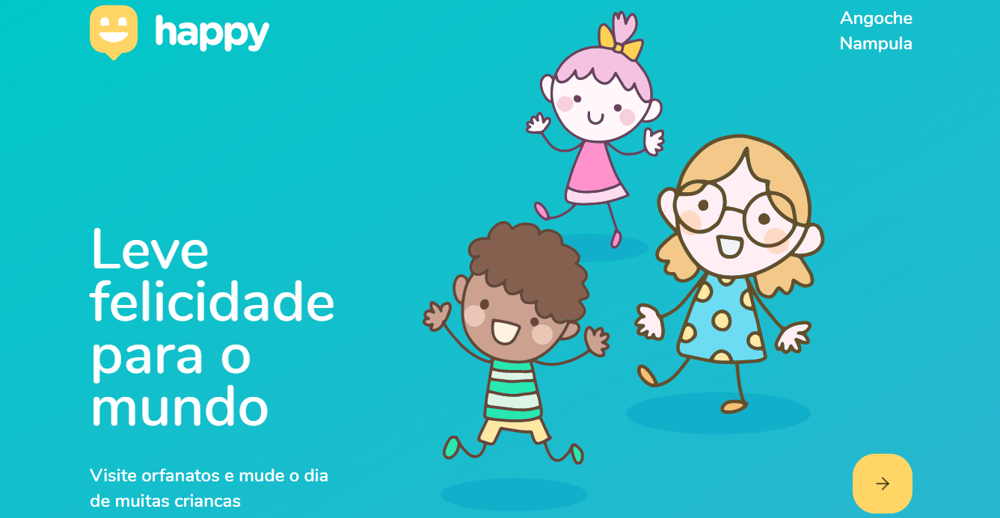

# Happy
Web and mobile react app to easily locate orphanages next to you for a visit and let the children happy. from Next Level Week 12.10.2020 [rocketseat](https://rocketseat.com.br/)

### To dos Day 1
- [x] Set up dev enviroment 
- [x] Presantations and how duplicate the app prototypes figma file.
- [x] React overview 
- [x] Create landing page using react, also css file
- [x] Create orphanagesMap page, also css file
- [x] Sign up [mapbox](https://www.mapbox.com/) and configure access key 
- [x] Add mapbox using on the orphanages map page
- [x] Push code

<h1 align="center">
    
</h1>

  <a href="#-tecnologias">Tecnologias</a>&nbsp;&nbsp;&nbsp;|&nbsp;&nbsp;&nbsp;
  <a href="#-projeto">Projeto</a>&nbsp;&nbsp;&nbsp;|&nbsp;&nbsp;&nbsp;
  <a href="#-layout">Layout</a>&nbsp;&nbsp;&nbsp;|&nbsp;&nbsp;&nbsp;
  <a href="#memo-licença">Licença</a>

 

  

 

  

## 🚀 Tecnologias

Esse projeto foi desenvolvido com as seguintes tecnologias:

- [Node.js](https://nodejs.org/en/)
- [React](https://reactjs.org)
- [React Native](https://facebook.github.io/react-native/)
- [Expo](https://expo.io/)
- [TypeScript](https://www.typescriptlang.org/)

## 💻 Projeto

O Happy é uma aplicação que conecta pessoas à casas de acolhimento institucional para fazer o dia de muitas crianças mais feliz 💜

## 🔖 Layout

Nos links abaixo você encontra o layout do projeto web e também do mobile. Você precisa ter uma conta no [Figma](http://figma.com/) para acessá-lo.

- [Layout Web](https://www.figma.com/file/mDEbnoojksG4w8sOxmudh3/Happy-Web)
- [Layout Mobile](https://www.figma.com/file/X27FfVxAgy9f5IFa7ONlph/Happy-Mobile)

## 🧠🧘🏿‍  Proximos passos

Guia no Notion referente aos desafios propostos para adicionar mais features a aplicação. E encontre um guia mostrando todo o passo a passo de como realizar o deploy tanto do backend quanto do frontend.

- [Desafio Happy 2.0](https://www.notion.so/Vers-o-2-0-do-Happy-c754db7a4d41469e8c2d00fcf75392c4)

## :memo: Licença

Esse projeto está sob a licença MIT. Veja o arquivo [LICENSE](LICENSE.md) para mais detalhes.

---

Feito por **Alan Caimo** e inspirado por [Rocketseat](https://rocketseat.com.br/) :wave: [junte-se na comunidade da Rocketseat! no Discord](https://discordapp.com/invite/gCRAFhc)

